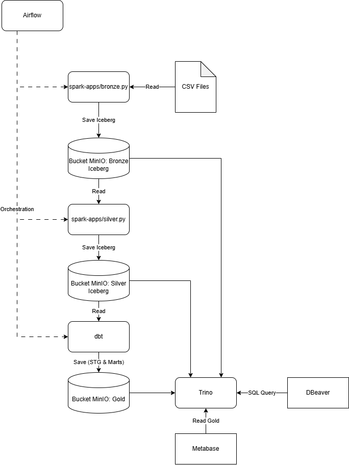
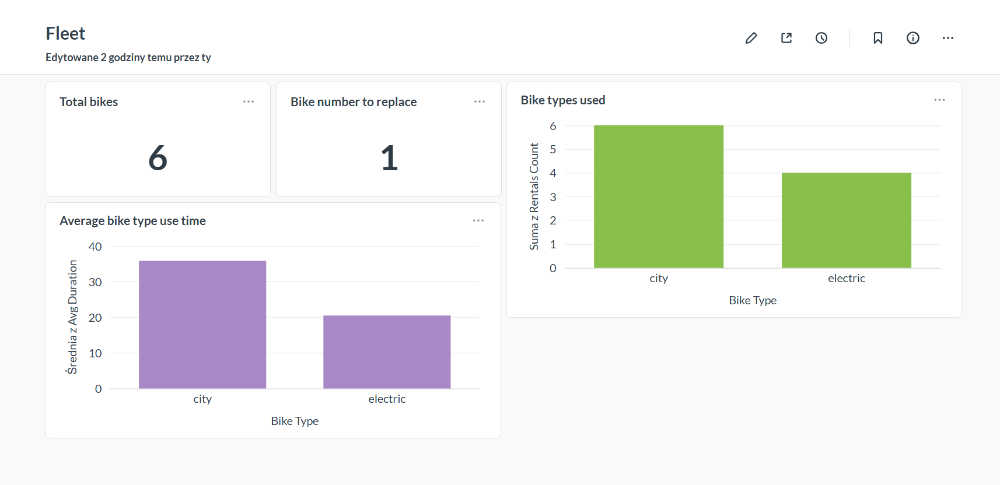
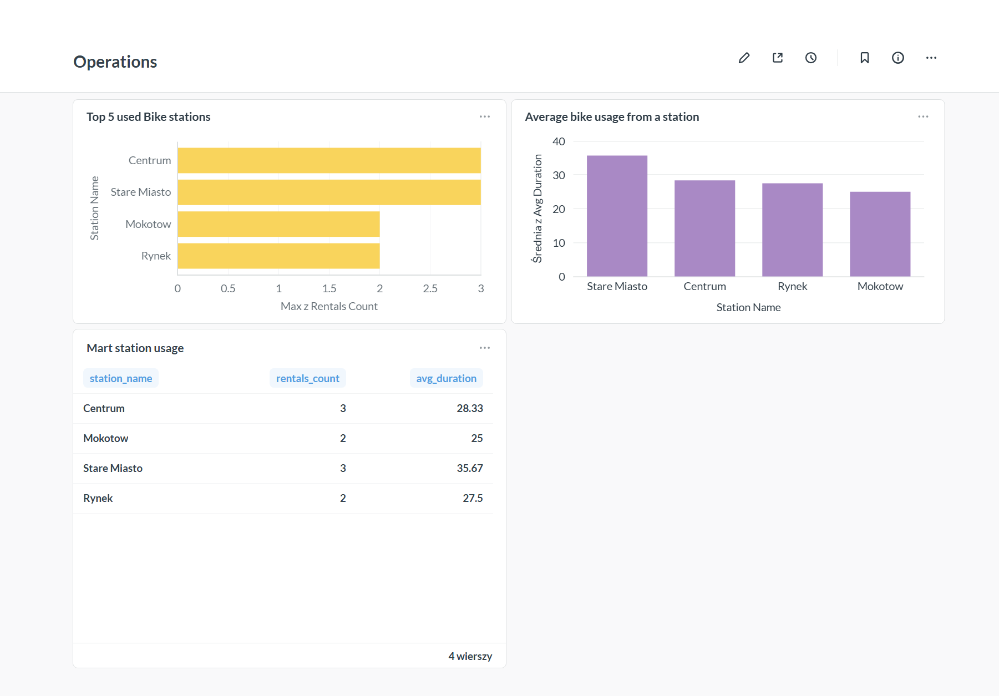

# 🎯 Project Goal
The goal of this project is to build a production-ready, end-to-end data platform for a fictional bike-sharing company. Covering the entire data lifecycle—from the ingestion of raw CSV files to orchestration, multi-stage transformations using the Medallion Architecture (Bronze, Silver, Gold), and serving actionable analytics—this solution showcases best practices in modern data engineering, including lakehouse storage with Apache Iceberg, automated data modeling with dbt, and interactive BI dashboards.

## 🛠️ Tech Stack

### 🚀 Core Platform & Processing
* **[Apache Airflow](https://airflow.apache.org/)** – DAG scheduling and workflow orchestration.
* **[Apache Spark](https://spark.apache.org/)** – Batch data processing and transformation (CSV to Bronze/Silver).
* **[dbt Core](https://www.getdbt.com/)** – Data modeling, staging (`stg`), and data marts construction in Gold layer.

### 💾 Storage & Data Lakehouse
* **[MinIO](https://min.io/)** – High-performance S3-compatible object storage.
* **[Apache Iceberg](https://iceberg.apache.org/)** – Open table format enabling ACID transactions and time travel across Lakehouse buckets (**Bronze**, **Silver**, **Gold**).

### 🔍 Query Engine & Analytics
* **[Trino](https://trino.io/)** – Distributed SQL query engine serving as a unified access layer over MinIO buckets.
* **[Metabase](https://www.metabase.com/)** – Business intelligence platform for interactive dashboards (connected exclusively to **Gold** layer).
* **[DBeaver](https://dbeaver.io/)** – Database GUI for ad-hoc querying, development, and debugging across all layers.

### 📐 Architecture & Tools
* **Medallion Architecture** – Multi-stage data organization pattern (Raw ➔ Enriched ➔ Curated).
* **Docker / Docker Compose** – Containerization and local infrastructure setup.

## 🏗️ Architecture
The platform follows a Medallion Architecture pattern to structure data processing across three distinct layers:

1. Ingestion (Bronze): Raw CSV files are ingested using Apache Spark triggered by Airflow and stored as Iceberg tables in MinIO.
2. Cleansing & Enrichment (Silver): Spark cleanses, types, and validates the raw data for downstream consumption.
3. Modeling & Marts (Gold): dbt transforms the Silver layer into business-ready dimensional models (stg & marts) stored in Gold buckets.
4. Serving & Analytics: Trino serves as the unified SQL engine. Metabase connects exclusively to the Gold layer for executive dashboards, while DBeaver allows ad-hoc queries across all layers for development and debugging.



## 🌟 Key Features
* **ACID Lakehouse Storage:** Full transactional support and schema enforcement using Apache Iceberg over object storage (MinIO).
* **Automated Data Quality & Lineage:** End-to-end lineage tracking and automated data transformations with dbt Core. Data Quality testing with use of dbt.
* **Orchestrated Pipelines:** Airflow DAGs automating ingestion, Spark execution, and dbt runs.
* **Strict Access Control / Layer Isolation:** Metabase BI access restricted strictly to the curated Gold layer to prevent reporting on unvalidated data.
* **Containerized Deployment:** Entire platform runs locally using Docker Compose for seamless setup and reproducibility.

## 🚀 Getting Started

### Prerequisites
* [Docker](https://www.docker.com/) & Docker Compose
* Minimum **8-16 GB RAM** allocated to Docker Engine

### Quick Start
1. **Clone the repository:**
   ```bash
   git clone [https://github.com/KrzysztofKaluza/Data-platform-exercise.git](https://github.com/KrzysztofKaluza/Data-platform-exercise.git)
   cd Data-platform-exercise
   ```
2. **Start the infrastructure:**
    ```
    docker compose up -d
    ```
3. **Access Services:**
    - Airflow UI: http://localhost:8083 (credentials: admin / admin)
    - MinIO Console: http://localhost:9001
    - Trino UI: http://localhost:8081
    - Metabase: http://localhost:3000

## 📁 Project Structure

```text
data-platform/
├── .devcontainer/             # DevContainer configuration for reproducible environment
├── data/                      # Raw source datasets (CSV) and sample Parquet outputs
│   ├── bikes.csv
│   ├── customers.csv
│   ├── maintenance.csv
│   ├── rentals.csv
│   └── stations.csv
├── dbt/                       # dbt project setup for Gold layer transformations
│   ├── bike_rental/           # Core dbt project folder
│   │   ├── models/            # Data transformation SQL models
│   │   │   ├── staging/       # Staging models (stg_*.sql) & schema validations
│   │   │   ├── intermediate/  # Intermediate transformations
│   │   │   ├── marts/         # Business-ready dimensional marts (mart_*.sql)
│   │   │   └── sources.yml    # Input source definitions
│   │   └── dbt_project.yml    # dbt configuration
│   ├── profiles/              # Trino connection profile (profiles.yml)
│   └── Dockerfile             # Custom dbt container definition
├── spark/                     # Spark environment configurations
│   └── Dockerfile             # Custom Spark image definition
├── spark-apps/                # PySpark data ingestion & processing pipelines
│   ├── bronze.py              # Raw CSV to Iceberg Bronze layer pipeline
│   └── silver.py              # Bronze to cleansed Silver layer pipeline
├── trino/                     # Trino query engine configurations
│   └── catalog/
│       └── iceberg.properties # Iceberg connector settings for MinIO
├── docker-compose.yml         # Platform service orchestration (Spark, Trino, MinIO, dbt)
└── pom.xml                    # Maven POM for downloading required Spark/AWS JAR dependencies
```

## 🛡️ Data Quality & Validation

Data quality is enforced across multiple layers of the platform using a two-tier validation strategy: programmatic filtering during Spark ETL runs and declarative testing during dbt modeling.

### 1. PySpark Inline Validation & Quarantining (Silver Layer)
During the Bronze-to-Silver transformation (`silver.py`), raw rental records undergo automated validation before hitting clean tables[cite: 1]:

* **Rule Checks:** Every record is evaluated for critical errors:
  * `RENTAL_ID_NULL`, `BIKE_ID_NULL`, `CUSTOMER_ID_NULL`[cite: 1]
  * `DURATION_NOT_POSITIVE` (e.g., negative duration or missing end times)[cite: 1]
* **Quarantine Strategy:** Records failing any check are flagged with error reason codes (`rental_errors_arr`) and appended to `iceberg.silver.rentals_errors` with a timestamp (`rejected_at`) for debugging and auditing[cite: 1].
* **Clean Pipeline:** Only error-free records pass through to `iceberg.silver.rentals_enriched`[cite: 1].

### 2. dbt Declarative Data Testing (Gold Layer)
The staging layer (`stg_*`) utilizes native dbt tests to guarantee entity integrity and relational consistency prior to building data marts[cite: 2]:

* **Primary Key Integrity:** `unique` and `not_null` assertions enforced on core entity identifiers (`bike_id`, `customer_id`, `station_id`) across dimensional sources[cite: 2].
* **Referential Integrity:** `relationships` tests ensure all transactions in `stg_rentals_enriched` map to valid keys in `stg_customers` and `stg_bikes`[cite: 2].

## 📊 Dashboards & Analytics

The serving layer utilizes **Metabase**, connected via **Trino** exclusively to the curated **Gold layer** (`marts`). This structure ensures that business users interact with consistent, pre-aggregated data models without hitting production transformation layers.

### 🚴 Fleet Management Dashboard

*Figure 1: Fleet-level insights showing bike counts, maintenance alerts, rental volumes, and average trip durations by bike type.*

Key metrics covered:
* **Total Bikes & Replacement Needs:** Tracks active inventory alongside bikes flagged for maintenance/replacement (`mart_bike_replacement`).
* **Bike Type Utilization:** Compares overall demand and trip durations between standard (`city`) and `electric` bikes (`mart_bike_usage`).

---

### 🚉 Operations Dashboard

*Figure 2: Operational performance metrics analyzing rental traffic and usage patterns across stations.*

Key metrics covered:
* **Station Performance:** Identifies high-traffic hubs (e.g., *Centrum*, *Stare Miasto*) and average trip durations per station (`mart_station_usage`).
* **Marts Integration:** Direct table view showcasing underlying Gold-layer metrics (`rentals_count`, `avg_duration`) consumed by BI widgets

